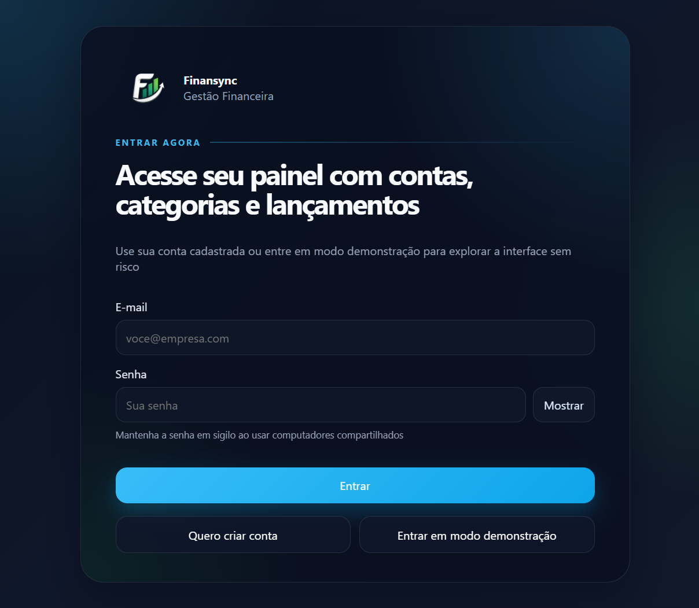
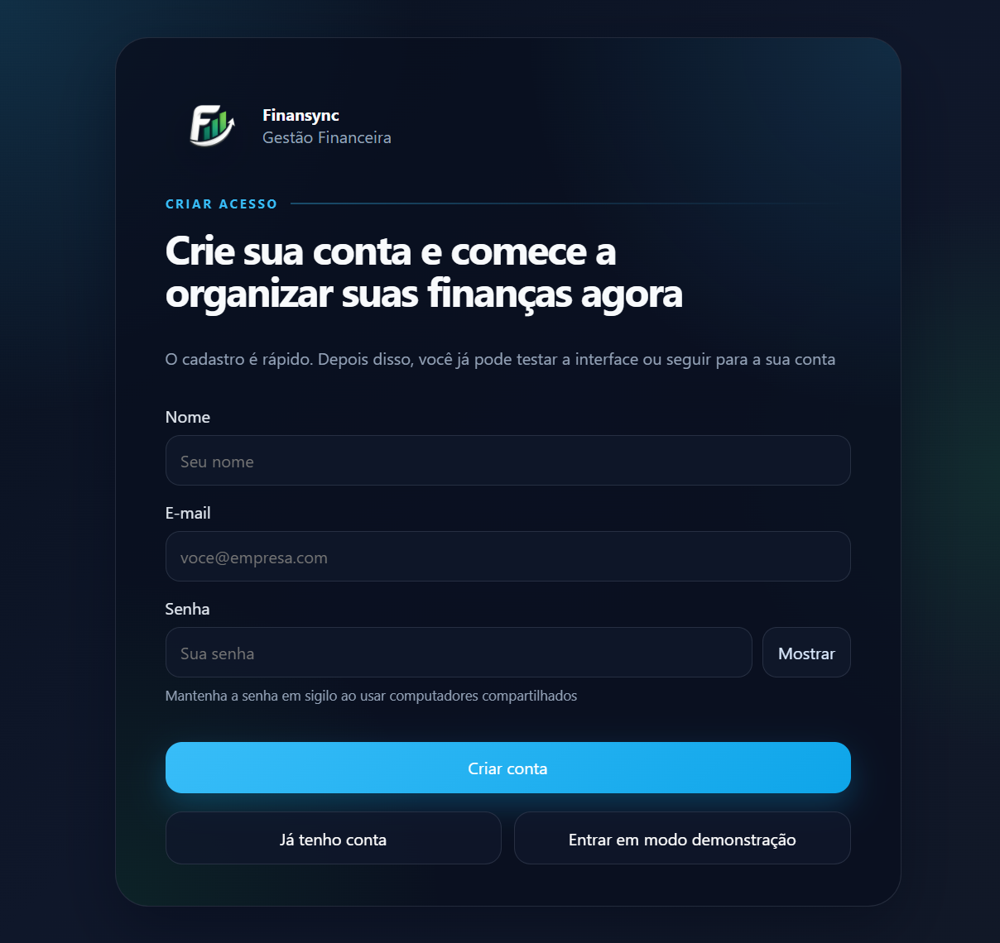
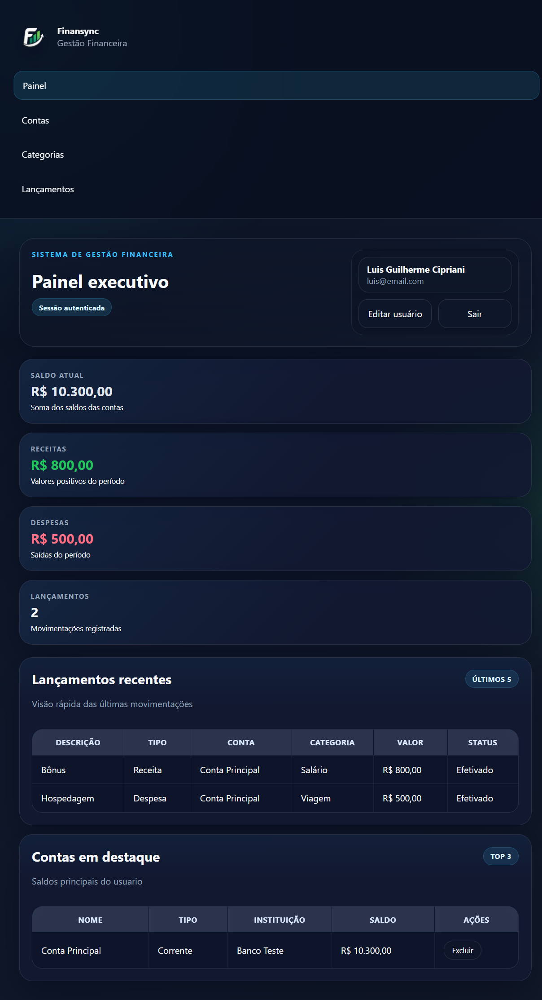
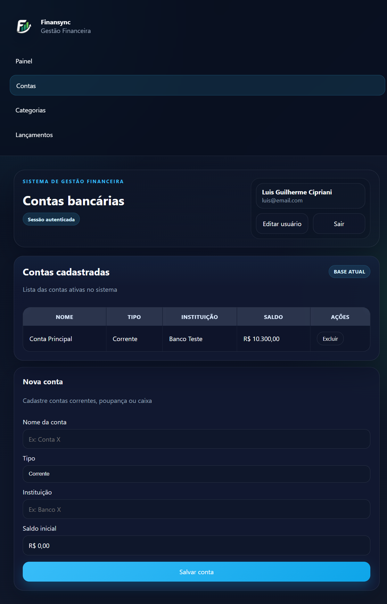
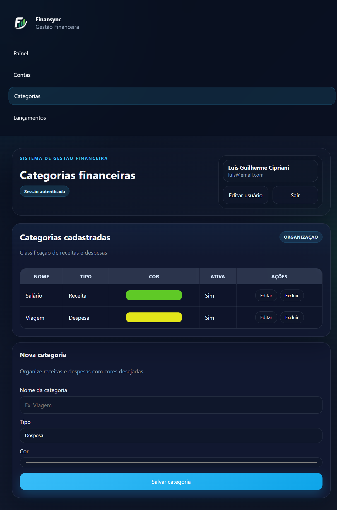
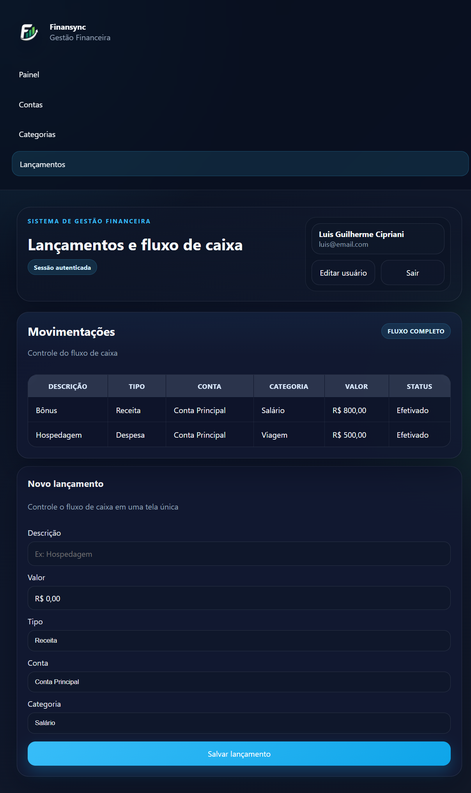

# Finansync Frontend

[](https://react.dev/)
[](https://vite.dev/)
[](https://developer.mozilla.org/docs/Web/JavaScript)
[](#licen%C3%A7a)

Interface web em React para o sistema financeiro Finansync. Este frontend foi pensado para oferecer uma experiência
clara, responsiva e elegante para autenticação, acompanhamento do painel, cadastro de contas, organização de categorias
e registro de lançamentos.

## Visão geral

- SPA construída com React e Vite
- Modo demonstração quando a API não está disponível
- Integração com a API do backend quando `VITE_API_URL` está configurado
- Interface com tema escuro, foco em contraste e leitura confortável
- Tabelas com realce visual por categoria
- Campos e listas adaptados ao fluxo financeiro real
- Persistência da aba ativa ao atualizar a página

## Destaques

- Experiência visual consistente entre login, painel e áreas operacionais
- Formulários com validação e comportamento adaptado ao contexto financeiro
- Tabelas com destaque por categoria e interação por hover
- Galeria de telas reais para apresentação no GitHub
- Integração opcional com a API do backend

## Galeria

As capturas abaixo mostram as principais telas da aplicação.

<table>
  <tr>
    <td align="center">
      
      <br />
      <strong>Login</strong>
    </td>
    <td align="center">
      
      <br />
      <strong>Cadastro</strong>
    </td>
  </tr>
  <tr>
    <td align="center">
      
      <br />
      <strong>Painel</strong>
    </td>
    <td align="center">
      
      <br />
      <strong>Contas</strong>
    </td>
  </tr>
  <tr>
    <td align="center">
      
      <br />
      <strong>Categorias</strong>
    </td>
    <td align="center">
      
      <br />
      <strong>Lançamentos</strong>
    </td>
  </tr>
</table>

## Tecnologias

- React 18
- Vite
- JavaScript

## Estrutura do projeto

- `src/App.jsx`: composição principal da aplicação
- `src/components`: componentes reutilizáveis da interface
- `src/services`: integração com a API e dados de apoio
- `src/styles`: estilos globais da aplicação
- `public`: arquivos estáticos
- `docs/images`: imagens utilizadas na documentação

## Requisitos

- Node.js 18 ou superior
- npm
- Backend do Finansync em execução, caso deseje usar dados reais

## Como executar

### 1. Instale as dependências

```bash
npm install
```

### 2. Configure o ambiente

Copie `.env.example` para `.env` e ajuste os valores conforme o seu cenário.

### 3. Inicie a aplicação

Modo desenvolvimento:

```bash
npm run dev
```

Build de produção:

```bash
npm run build
```

Preview do build:

```bash
npm run preview
```

## Variáveis de ambiente

| Variável | Descrição |
| --- | --- |
| `VITE_API_URL` | URL base da API do Finansync |
| `FRONTEND_PORT` | Porta do servidor de desenvolvimento do Vite |

### Exemplo

```env
VITE_API_URL=http://localhost:3333/api/v1
FRONTEND_PORT=3000
```

## Modos de operação

### Modo demonstração

Quando a API não está disponível, o frontend carrega dados simulados para permitir navegação e validação visual.

### Modo autenticado

Quando `VITE_API_URL` está configurado, a aplicação autentica o usuário e passa a consumir a API real do backend.

## Funcionalidades

### Autenticação

- Login
- Cadastro de conta
- Logout seguro
- Recuperação de sessão
- Atualização de perfil

### Painel

- Saldo atual
- Receitas e despesas
- Quantidade de lançamentos
- Lançamentos recentes
- Contas em destaque

### Contas

- Cadastro de contas correntes, poupança e caixa
- Edição e exclusão
- Listagem em tabela

### Categorias

- Cadastro de categorias com cor personalizada
- Edição e exclusão
- Cores destacadas nas listagens

### Lançamentos

- Cadastro e edição de lançamentos
- Seleção dependente de tipo, conta e categoria
- Cores da categoria na tabela
- Destaque visual ao passar o mouse

## Comportamentos importantes

- O campo `Categoria` em lançamentos só mostra categorias compatíveis com o tipo escolhido
- Os campos `Conta` e `Categoria` exibem mensagens claras quando não existem registros
- A aba ativa permanece salva ao recarregar a página
- O painel exibe o mesmo padrão visual de destaque das demais telas

## Layout e UX

O projeto foi desenhado para evitar uma interface genérica e sem identidade.

- Sidebar escura com navegação fixa
- Cabeçalhos fortes e hierarquia visual clara
- Cartões com profundidade sutil
- Botões com contraste elevado
- Tabelas legíveis e bem espaçadas
- Realce de linhas e colunas ao interagir com os dados

## Organização dos componentes

- `AuthCard`: login e cadastro
- `Sidebar`: navegação lateral
- `Topbar`: cabeçalho principal com ações do usuário
- `MetricCard`: cards de indicadores
- `SectionCard`: blocos de conteúdo
- `DataTable`: tabelas reutilizáveis
- `QuickForm`: formulários das telas principais

## Integração com o backend

O frontend foi projetado para trabalhar com a API do Finansync sem alterar a camada de consumo.

Em desenvolvimento, um valor comum para a API é:

```env
VITE_API_URL=http://localhost:3333/api/v1
```

## Scripts

- `npm run dev`: inicia o ambiente de desenvolvimento
- `npm run build`: gera a versão de produção
- `npm run preview`: visualiza o build localmente

## Contribuição

1. Crie uma branch para a alteração
2. Faça os ajustes necessários
3. Execute `npm run build`
4. Abra um pull request com a descrição da mudança

## Licença

Projeto distribuído sob licença MIT.
