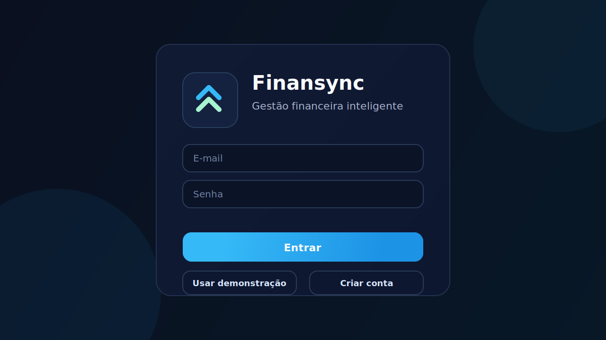
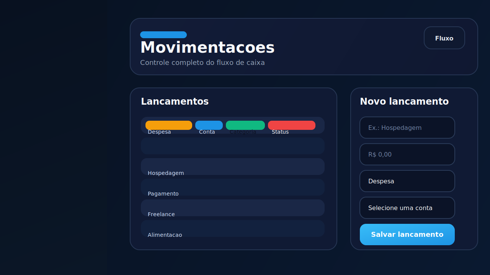

# Finansync Frontend

Interface web em React para o sistema financeiro Finansync. Este frontend entrega uma experiência
visual moderna para acompanhar o painel, gerenciar contas, organizar categorias e registrar lançamentos,
com suporte a modo demonstração e integração com a API do backend.

## Visão Geral

- SPA construída com React e Vite
- Interface responsiva com tema escuro e identidade visual consistente
- Modo demonstração quando a API não está disponível
- Fluxo autenticado quando conectado ao backend
- Telas dedicadas para painel, contas, categorias e lançamentos
- Exibição de cores e estados visuais nas tabelas e formulários

## Galeria

As imagens abaixo ilustram a experiência visual do sistema.

### Login



### Painel


### Lançamentos



## Tecnologias

- React 18
- Vite
- JavaScript

## Estrutura do projeto

- `src/App.jsx`: composição principal da aplicação
- `src/components`: componentes reutilizáveis
- `src/services`: integração com a API e dados de apoio
- `src/styles`: estilos globais e específicos do layout
- `public`: arquivos estáticos públicos
- `docs/images`: imagens usadas nesta documentação

## Requisitos

- Node.js 18 ou superior
- npm
- Backend do Finansync em execução, caso queira consumir a API real

## Como executar

### 1. Instalar dependências

```bash
npm install
```

### 2. Configurar ambiente

Copie `.env.example` para `.env` e ajuste conforme o seu cenário.

### 3. Iniciar o projeto

Modo desenvolvimento:

```bash
npm run dev
```

Build de produção:

```bash
npm run build
```

Preview do build:

```bash
npm run preview
```

## Variáveis de ambiente

| Variável | Descrição |
| --- | --- |
| `VITE_API_URL` | URL base da API do Finansync |
| `FRONTEND_PORT` | Porta usada pelo servidor de desenvolvimento |

### Exemplo

```env
VITE_API_URL=http://localhost:3333/api/v1
FRONTEND_PORT=3000
```

## Integração com o backend

Quando `VITE_API_URL` está definido, o frontend passa a operar em modo autenticado e busca os
dados diretamente da API.

Quando a API não está disponível, a aplicação entra em modo demonstração para permitir navegação
e validação visual da interface.

## Funcionalidades principais

### Autenticação

- Login
- Cadastro de usuário
- Recuperação de sessão
- Logout seguro
- Atualização de perfil do usuário

### Painel

- Indicadores de saldo, receitas, despesas e quantidade de lançamentos
- Resumo com lançamentos recentes
- Destaque de contas importantes

### Contas

- Cadastro de contas
- Edição e exclusão
- Visualização em tabela

### Categorias

- Cadastro de categorias com cor personalizada
- Edição e exclusão
- Exibição da cor nas listagens

### Lançamentos

- Criação e manutenção de lançamentos
- Seleção dependente entre tipo, conta e categoria
- Cores por categoria nas tabelas
- Persistência da aba ativa ao atualizar a página

## Scripts disponíveis

- `npm run dev`: inicia o ambiente de desenvolvimento
- `npm run build`: gera a versão de produção
- `npm run preview`: visualiza o build localmente

## Comportamentos importantes

- O campo `Categoria` em lançamentos só mostra categorias compatíveis com o tipo escolhido
- O campo `Conta` e `Categoria` exibem mensagens claras quando não há registros
- As tabelas usam realce visual em linhas e categorias para facilitar leitura
- A aba atual permanece salva ao recarregar a página

## Layout

O projeto foi pensado para manter uma identidade visual consistente:

- sidebar escura com navegação fixa
- cartões com bordas suaves e profundidade sutil
- botões e chips com azul claro de destaque
- tabelas legíveis com cabeçalhos destacados
- foco em contraste e hierarquia visual

## Organização dos componentes

- `AuthCard`: login, cadastro e mensagens de sessão
- `Sidebar`: navegação lateral
- `Topbar`: cabeçalho da área principal
- `MetricCard`: cards de indicadores
- `SectionCard`: blocos de conteúdo
- `DataTable`: tabelas reutilizáveis
- `QuickForm`: formulários rápidos das telas

## Banco de dados e ambiente

Este frontend pode operar com:

- API real apontada por `VITE_API_URL`
- dados de demonstração embutidos no projeto

## Contribuição

1. Crie uma branch para sua alteração
2. Faça os ajustes no código
3. Execute `npm run build`
4. Abra um pull request com uma descrição clara

## Licença

Projeto distribuído sob licença MIT.

